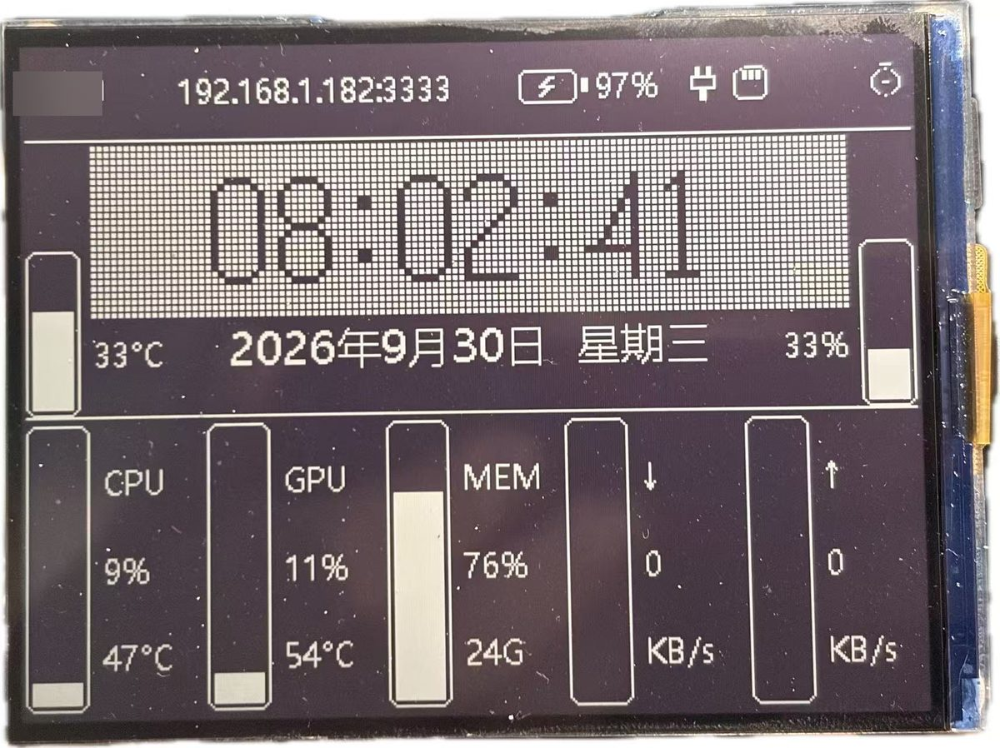
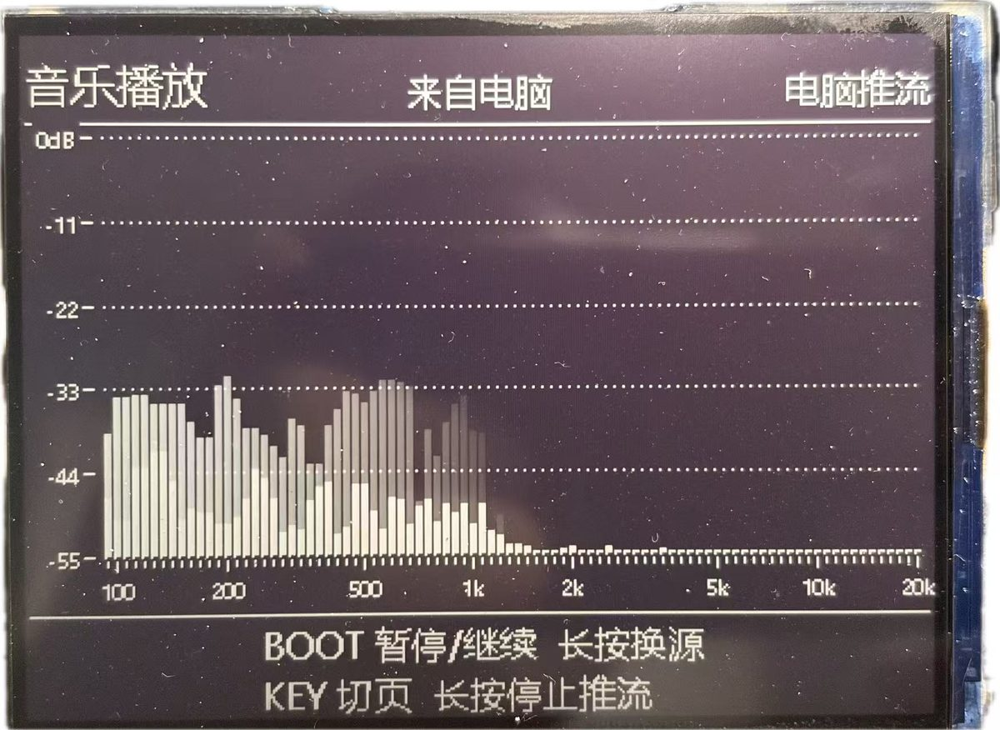
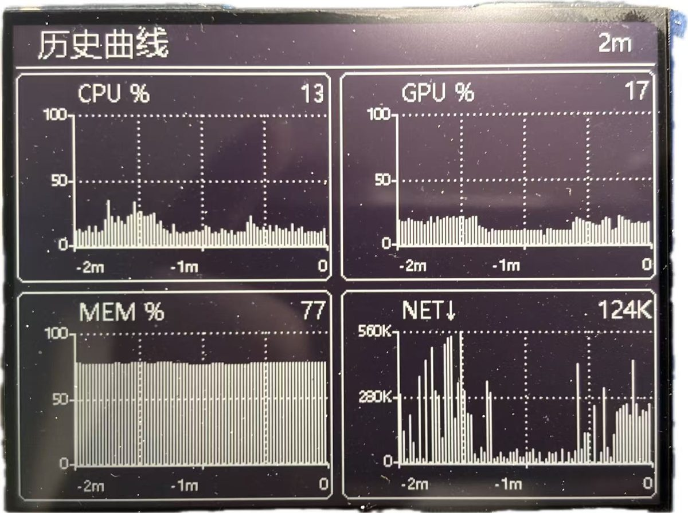

# ESP32-S3 RLCD 桌面时钟

一块 **400×300 单色反射式液晶**上的桌面时钟。除了看时间,还能放 TF 卡里的音乐、
跟着音乐跳频谱,并且把**电脑的 CPU / 内存 / GPU / 网速**实时显示出来
(顶栏 5 根资源柱 + 一整页历史曲线)。

硬件是 Waveshare **ESP32-S3-RLCD-4.2**。

> 这块屏**没有背光也没有触摸** —— 靠环境光显示,拿到亮的地方才看得清。
> 暗处什么都看不见不是坏了。

<!--
================================================================
  效果图 —— 拍好照片后去掉这一整段注释即可(只有一对注释符号,
  删掉最上面这行和最后面那行就行)
================================================================

这块屏是反射式的、靠环境光显示,所以【实拍比任何截图或模拟图都有说服力】。
拍的时候找光线好的地方,尽量正对屏幕、避开反光。

准备三张,放进 docs/,文件名照下面写:

    docs/shot-clock.jpg     时钟页
    docs/shot-music.jpg     音乐页(最好是在放歌、频谱跳起来的时候)
    docs/shot-sys.jpg       曲线页

去掉注释后就是三张并排的表格:

| 时钟页 | 音乐页 | 曲线页 |
|---|---|---|
|  |  |  |

只有一两张也行,把上面那个表格换成单张就好:


-->

---

## 功能

| 页面 | 内容 |
|---|---|
| **时钟页** | 时间(方块点阵大字)、日期星期、温湿度、电池/充电状态、WiFi 名、IP、TF 卡状态;左侧 5 根资源柱(CPU / GPU / 内存 / ↓ / ↑) |
| **音乐页** | 播放 TF 卡里的 WAV;90 段实时频谱;三种频谱源可切换 |
| **曲线页** | 4 张历史曲线:CPU% / GPU% / MEM% / 网速(Y 轴横向网格,X 轴显示时间跨度) |

**三种频谱源**(BOOT 键长按轮换):

- `播放音乐` —— TF 卡里的 WAV
- `麦克风` —— 板载 ES7210 麦克风阵列
- `电脑推流` —— 电脑声音实时推过来

---

## 硬件

| | |
|---|---|
| 开发板 | Waveshare ESP32-S3-RLCD-4.2 |
| 主控 | ESP32-S3-WROOM-1-**N16R8**(16MB flash + 8MB 八线 PSRAM) |
| 屏幕 | 400×300 单色(1bpp)反射式 ST7305,无背光、无触摸 |
| 音频 | ES8311 DAC + ES7210 ADC(麦克风阵列),PA 使能 GPIO46 |
| 传感器 | SHTC3 温湿度 + PCF85063 RTC |
| 按键 | KEY = GPIO18,BOOT = GPIO0(都是低电平有效) |

<details>
<summary>引脚 / 端口一览</summary>

| 用途 | 引脚 |
|---|---|
| LCD | MOSI 12 / SCLK 11 / DC 5 / CS 40 / RST 41 |
| I2C0 | SDA 13 / SCL 14(SHTC3 `0x70`,PCF85063 `0x51`) |
| I2S0 | MCLK 16 / BCLK 9 / WS 45 / DOUT 8 / DIN 10 |
| 电池检测 | GPIO4(ADC1_CH3,1:3 分压) |

| 网络端口 | 用途 |
|---|---|
| TCP **3333** | 电脑 → 板子推音频(裸 PCM 48000Hz/2ch/16bit LE;反向发 `STOP` 停流) |
| TCP **3334** | 电脑 → 板子推资源遥测(每行一条 `键=值`,空格分隔) |

BLE:`ESP32-RLCD`,服务 `0xAB00`(控制 `0xAB01` / 音量 `0xAB02` / 状态 `0xAB03`)

</details>

---

## 仓库结构

```
firmware/            ESP-IDF 工程
  components/
    user_app/        界面、按键、WiFi/NTP、各页面渲染
    ui_draw/         1bpp 绘图层 + 自造点阵字库(界面文字、方块时钟)
    spectrum/        4096 点 FFT → 90 个对数频段
    audio_player/    I2S 输出 + ES8311/ES7210
    wav_player/      TF 卡 WAV 读取
    net_audio/       TCP 音频推流接收
    sysmon/          PC 资源遥测接收 + 历史缓冲
    sdcard/ battery/ board_sensors/ ble_ctrl/ port_bsp/ u8g2_st7305/ u8g2/
  main/
  sdkconfig.defaults  ★ 关键配置(PSRAM 八线、16MB flash、TCP 窗口…)

pc-tools/            电脑端
  pc_monitor.py       ★ 资源监视器上位机(推 CPU/内存/GPU/网速)
  stream_audio.py     ★ 把电脑声音推到板子
  wascap/             C# 写的 WASAPI 回环采集(零依赖,编译出单个 exe)
  capture.py          抓串口日志
  build.ps1           编译包装(固定大核,避开小核)
  fontgen/            界面字库 / 方块时钟字形的生成与预览工具

docs/                使用文档
  烧录说明.md          从零开始的烧录指南
  WiFi配置说明.md      中文配网说明
  How_to_Configure_WiFi.md   English
  使用说明.md          上位机使用说明
  wifi.txt            配网模板
```

---

## 编译与烧录

需要 **ESP-IDF v6.1**。

```bash
cd firmware
idf.py set-target esp32s3
idf.py build
idf.py -p COM5 flash monitor
```

打包成"单文件直接烧 0x0"的固件:

```bash
idf.py build merge-bin        # → build/merged-binary.bin
```

> Windows 上如果编译慢,可以用 `pc-tools/build.ps1` —— 它把编译进程
> 钉在性能核上,避开 Windows 把短命子进程丢到小核的调度习惯。

### WiFi 配置

**推荐:TF 卡根目录放一个 `wifi.txt`**(不用重新编译):

```
ssid=你家的WiFi名字
pass=你家的WiFi密码
```

**也可以编进固件:** 把 `firmware/components/user_app/wifi_secrets.h.example`
复制成同目录的 `wifi_secrets.h` 并填上凭据。

> ⚠️ `wifi_secrets.h` **不进版本库**(见 `.gitignore`)。
> 真实密码写在源码里再提交,即使之后删掉也永远留在 git 历史中。

TF 卡里的配置**优先级更高**,会在启动后覆盖固件里编的。

详细说明见 `docs/WiFi配置说明.md`。

---

## 电脑端

### 资源监视器

```bash
python pc-tools/pc_monitor.py            # 自动扫局域网找板子
python pc-tools/pc_monitor.py 192.168.1.182
```

需要 `psutil`;装了 `nvidia-ml-py` 能更快地读 GPU。CPU 温度在 Windows 上
必须借第三方工具(LibreHardwareMonitor 或 HWiNFO),拿不到就显示 `--`。

### 声音推流

```bash
python pc-tools/stream_audio.py "某首歌.mp3"     # 推文件
wascap\wascap.exe                                # 推电脑正在放的声音
```

`wascap` 是 C# 写的 WASAPI 环回采集,零第三方依赖,用 `csc.exe` 直接编译成
单个 exe(`pc-tools/wascap/build.bat`)。实测单核占用 0.5%。

---

## 按键

| 按键 | 操作 | 时钟页 | 音乐页 | 曲线页 |
|---|---|---|---|---|
| **KEY** | 短按 | 切页 → | 切页 → | 切页 → |
| | 长按 | 12/24 小时制 | 下一首 | 立即重画 |
| | 双击 | — | 上一首 | — |
| **BOOT** | 短按 | — | 播放 / 暂停 | — |
| | 长按 | — | 轮换频谱源(按住不放,每 2 秒换一个,松手定住) | — |

电脑正在推流时:**长按 KEY = 停止推流**(不可逆,所以单独占一个键),
**短按 BOOT = 暂停/继续推流**。

但**切源只是“让出喇叭”**,不会关掉电脑端程序 —— 切走再切回来立刻有声,
**不用重新双击 `wascap.exe`**。真想让电脑端程序退出来,得用上面那条“停止推流”。
源停在「电脑推流」但电脑还没连上时,右上角会显示 **`等电脑连接`**。

---

## 几个技术要点

做这个项目踩过的坑,记在这里,也许对别人有用。

### 1bpp 屏没有"灰" —— 只能用线宽表达层次

单色屏只有开和关。想做出参考图那种"白底 + 淡网格 + 黑字"的效果,
靠的是**线宽**而不是灰度:

```
白底 → 1px 黑网格线(远看=浅灰)→ 粗黑笔画(最黑)
```

反过来(黑底 + 白网格)**不行**:网格和字同色,互相抢注意力。
用"留缝"模拟灰度也不行 —— 黑像素占比掉到 44% 就混成灰色了。

### 点阵字的粗细 = 1 / 点阵行数

和放大倍数**无关**。8 行就是 1/8(显胖),16 行才是 1/16。

显示高度被版面锁死时,`行数 × 放大倍数 = 常数`,所以**想让字变细只能加行数**,
不能减放大倍数(那只是把胖字缩小)。

### FFT 的分辨率 = 采样率 / 点数

对数频段每段比前一段宽 6.14%,所以频段间距是 `0.0614 × f`。
要让它追得上一个 bin,得 `f ≥ bin宽 / 0.0614`。

512 点时 bin 宽 93.75Hz → 1.5kHz 以下所有柱子都在抢同一两个 bin,
屏上就是"100Hz 附近好几条一起上下"。换成 **4096 点**(bin 11.7Hz)就分开了。

### 内部 RAM 要盯死

任务栈只能从**内部 RAM** 切,PSRAM 帮不上忙。曾经把 64KB 的 FFT 缓冲
写成静态数组,结果开机后内部 RAM 只剩 711 字节,**四个任务全部创建失败**,
而 `xTaskCreate` 的返回值没人检查 —— 现场是"屏幕停在开机那一帧",
串口风平浪静。

所以:

- 几 KB 以上的缓冲一律 `heap_caps_aligned_alloc(..., MALLOC_CAP_SPIRAM)`,
  **不写 `static`**(静态数组无论用不用都占内部 RAM)
- 所有 `xTaskCreate` 都要检查返回值
- 用 `esp_get_free_internal_heap_size()`,别用 `esp_get_free_heap_size()`
  (后者把 8MB PSRAM 也算进去,数字永远好看)

---

## 第三方代码与致谢

| 组件 | 来源 | 许可证 |
|---|---|---|
| `components/u8g2/` | [olikraus/u8g2](https://github.com/olikraus/u8g2) | BSD 2-Clause |
| `components/port_bsp/` | ST7305 初始化序列参考 [Waveshare 官方示例](https://github.com/waveshareteam/ESP32-S3-RLCD-4.2) | 见其仓库说明 |
| `espressif/esp-dsp` | ESP 组件注册表,构建时自动下载 | Apache-2.0 |
| `espressif/esp_codec_dev` | 同上 | Apache-2.0 |

> 本仓库里的 `u8g2` 组件已经**裁掉了两个 fonts 文件**
> (`u8g2_fonts.c` 38MB / `u8x8_fonts.c` 1.5MB)—— 这个工程的文字全部走自写的
> `components/ui_draw`,用不到 u8g2 自带字体。需要恢复时见该目录 CMakeLists 的说明。

本人原创的部分(其余 components、`pc-tools/`、`docs/`)以 **MIT** 许可发布,
见 `LICENSE`。

---

## 已知问题

- 12 小时制下 `AM/PM` 和湿度数值的擦除框有约 12px 重叠(24 小时制不受影响)
- 频谱的 FFT 工作区放在 PSRAM,单次约 7ms;改回内部 RAM 会快 3 倍左右,
  但要占掉 32KB 内部 RAM
